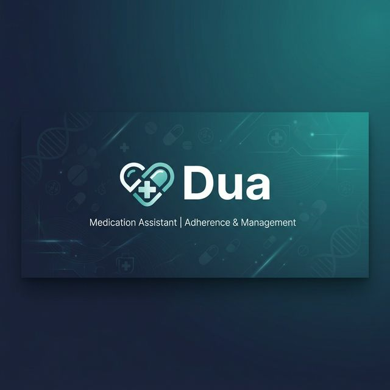

# <p align="center">Dua - Smart Medication Assistant 💊</p>

<p align="center">
  
</p>

<p align="center">
  <a href="https://github.com/islam-eldein/DUA-APP">
    
  </a>
  <a href="https://github.com/islam-eldein/DUA-APP/network/members">
    
  </a>
  <a href="https://github.com/islam-eldein/DUA-APP/blob/main/LICENSE">
    
  </a>
  
</p>

---

## 📖 Introduction

**Dua** is a professional, elegantly designed Flutter application that empowers users to search for medications, check prices, and find alternative treatments with ease. Built with a focus on premium UI/UX (the **Medical Slate** design system), it provides a seamless and trusted experience for managing healthcare information.

<p align="center">
  
</p>

## 🚀 Table of Contents
- [✨ Key Features](#-key-features)
- [🎨 Design Philosophy](#-design-philosophy-medical-slate)
- [🏗️ Architecture](#️-architecture-clean-architecture)
- [🛠️ Technical Stack](#️-technical-stack)
- [📦 Installation & Setup](#-installation--setup)
- [🤝 Contributing](#-contributing)
- [📞 Contact & Support](#-contact--support)
- [📜 License](#-license)

---

## ✨ Key Features

### 🔍 Smart Medication Search
Quickly find medications by name or active ingredient. The search system uses a remote data source to ensure up-to-date information on availability and pricing.

### 💡 Alternative Discovery
Stop wasting time searching for alternatives. Dua automatically suggests equivalent medications with the same active ingredients, helping users find cost-effective options.

### ❤️ Smart Favorites
Save your most important medications for quick viewing. Offline support is planned for future updates.

### 🛡️ Secure Access Control
Integrated security features including a sleek splash screen and access verification to ensure a professional and safe user experience.

### 🌍 Professional Arabic Support
Tailored specifically for Arabic-speaking users with professional **Cairo** typography and Right-to-Left (RTL) layout optimization.

### 📸 Smart Sharing
Share medication cards as high-quality images directly from the app, making it easy to consult with doctors or pharmacists.

---

## 🎨 Design Philosophy: Medical Slate

Dua is built on the **Medical Slate** design language, characterized by a premium and calming aesthetic:

- **Calming Palette**: Deep Indigo (`#1E40AF`) and Medical Teal (`#0D9488`) on a soft Slate background.
- **Premium Components**: Custom-built cards, shimmers, and interactive elements.
- **Micro-Animations**: Uses `animate_do` for subtle, professional transitions that enhance user trust and engagement.
- **Typography**: Optimized readability with **Cairo** (Arabic) and **Inter** (Latin).

---

## 🏗️ Architecture: Clean Architecture

The project follows strict **Clean Architecture** principles to ensure modularity, scalability, and maintainability.

### 📁 Directory Structure
```text
lib/
├── core/               # Shared logic, themes, and common widgets
│   ├── di/             # Dependency injection (GetIt)
│   ├── network/        # API clients and network logic
│   ├── theme/          # Medical Slate theme definitions
│   ├── widgets/        # Reusable premium UI components
│   └── error/          # Failure and exception handling
└── features/           # Modular business logic (Clean Architecture)
    ├── access_control/ # Security and initialization
    ├── drug_search/    # Search and results logic
    ├── drug_details/   # Detailed info and alternatives
    ├── favorites/      # Offline data management
    └── app_info/       # Application information screen
```

### 🧱 Layer Decomposition
- **Data Layer**: Repositories, data sources, and models (Hive/API).
- **Domain Layer**: Pure business logic (Entities and Use Cases).
- **Presentation Layer**: BLoC/Cubit for state management and Flutter UI.

---

## 🛠️ Technical Stack

| Category | Technology |
| :--- | :--- |
| **Framework** | [Flutter](https://flutter.dev/) (^3.7.2) |
| **State Management** | [flutter_bloc](https://pub.dev/packages/flutter_bloc) |
| **Local Database** | [Hive](https://pub.dev/packages/hive) |
| **Dependency Injection** | [GetIt](https://pub.dev/packages/get_it) |
| **Functional Error Handling** | [Dartz](https://pub.dev/packages/dartz) |
| **UI Components** | [Animate Do](https://pub.dev/packages/animate_do), [Shimmer](https://pub.dev/packages/shimmer) |
| **Utilities** | [Share Plus](https://pub.dev/packages/share_plus), [Url Launcher](https://pub.dev/packages/url_launcher) |

---

## 📦 Installation & Setup

### 📋 Prerequisites
- [Flutter SDK](https://docs.flutter.dev/get-started/install) (^3.7.2)
- Android Studio / VS Code
- An Android/iOS device or emulator

### 🛠️ Step-by-Step Guide
1. **Clone the repository:**
   ```bash
   git clone https://github.com/islam-eldein/DUA-APP.git
   ```
2. **Navigate to the project directory:**
   ```bash
   cd DUA-APP
   ```
3. **Install dependencies:**
   ```bash
   flutter pub get
   ```
4. **Run the application:**
   ```bash
   flutter run
   ```

---

## 🤝 Contributing

Contributions are what make the open-source community such an amazing place to learn, inspire, and create. Any contributions you make are **greatly appreciated**.

1. Fork the Project
2. Create your Feature Branch (`git checkout -b feature/AmazingFeature`)
3. Commit your Changes (`git commit -m 'Add some AmazingFeature'`)
4. Push to the Branch (`git push origin feature/AmazingFeature`)
5. Open a Pull Request

---

## 📞 Contact & Support

If you have any questions or need support, feel free to reach out:

- **GitHub**: [ISLAM ELDEIN](https://github.com/islam_eldein)
- **Telegram**: [ISLAM ELDEIN](https://t.me/islam_eldein)
- **Project Link**: [https://github.com/islam-eldein/DUA-APP](https://github.com/islam-eldein/DUA-APP)

---

## 📜 License

Distributed under the **MIT License**. See `LICENSE` for more information.

<p align="center">
  <b>Created by <a href="https://github.com/islam-eldein">ISLAM ELDEIN</a> - 2026</b>
</p>
